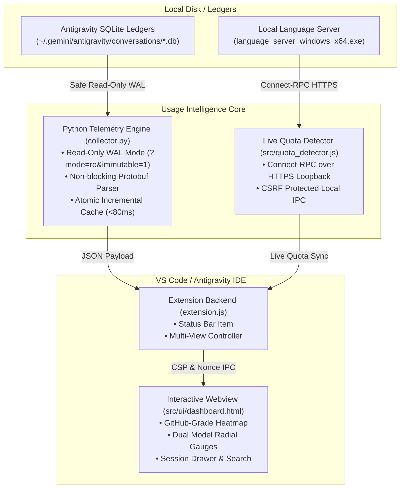

# Antigravity Usage — Token Tracker & Quota Intelligence

<p align="center">
  
</p>

<p align="center">
  <strong>Antigravity usage tracker & live model quota monitor. Real-time Gemini & Claude token tracking, prompt cache savings, activity heatmaps & session analytics. 100% local & private.</strong>
</p>

<p align="center">
  <a href="https://github.com/Nir-Bhay/antigravity-usage-intelligence/actions"></a>
  <a href="https://marketplace.visualstudio.com/items?itemName=nirbhay-hiwse.antigravity-usage-intelligence"></a>
  <a href="https://open-vsx.org/extension/nirbhay-hiwse/antigravity-usage-intelligence"></a>
  <a href="LICENSE"></a>
  
  
  
</p>

<p align="center">
  <em>Unofficial, community-built extension. Not affiliated with or endorsed by Google. Local-only: no internet access.</em>
</p>

<p align="center">
  
</p>

---

## 🇨🇳 增强版特性 (Enhanced Chinese Edition)

本分支在官方原版基础上，经过深度对抗性审查与第一性原理优化，带来以下关键升级：

- **🏮 全界面深度中文本地化**：完整汉化全屏仪表盘、VS Code 侧边栏、底部状态栏、配额预警通知以及导出的 Markdown / CSV 报告。
- **💰 官方多模型精准费率矩阵**：修复原版按单一平铺费率计价的严重失真。内置 Gemini 3.8/3.7/3.6/3.5/3.1 Pro、Claude Sonnet 4.6 与 Claude Opus 官方阶梯输入/输出/缓存费率，精确呈现上下文缓存（Context Cache）实际为您节省的美元金额。
- **⚡ Windows 配额探测抗抖动与零 CPU 激增**：重构 `quota_detector.js`，引入内存 TTL 缓存与扫描防抖机制，杜绝高频唤起 Windows PowerShell 导致的 CPU 峰值。
- **🕒 本地时区自动校准**：修复 24 小时全天候活跃分布图的 8 小时 UTC 时差，精准还原您在当地时间的真实编码节律。
- **🌐 独立单文件网页与 Web 服务**：无需依赖 VS Code，直接通过 Python 即可使用：
  ```bash
  # 1. 终端直接查看分析概览
  python collector.py

  # 2. 导出单文件独立 HTML 网页报告（可离线随处在浏览器双击打开）
  python collector.py --export-html my_report.html

  # 3. 启动本地轻量 Web 服务
  python collector.py --serve 9090
  ```

---

## ⚡ Overview

Google Antigravity builds deep contextual abstractions, indexes multi-repo codebases, and executes autonomous tool loops. In active projects, pairing with frontier models pushes tens of millions of tokens daily across **Gemini 3.8 Flash**, **Gemini 3.7 Flash**, **Claude Sonnet 4.6**, and **Claude Opus 4.6**.

Until now, developers were flying blind:
- **Hidden Context Burn**: No visibility into whether an agent turn re-read 200K cached tokens or triggered a costly raw prompt rebuild.
- **Buried Reasoning Overhead**: Frontier thinking tokens were locked inside internal SQLite protobuf blobs without dedicated tracking.
- **Unverified Quotas**: Artificial fixed limits gave misleading alarms instead of tracking official server-side pools.
- **Zero Session Forensics**: No fast way to audit modified files, tool execution counts, or long-term developer consistency.

**Antigravity Usage Intelligence** solves this completely. Operating **100% locally and privately**, it extracts session ledgers directly from your machine and connects to the Antigravity Language Server via Connect-RPC to provide a real-time, responsive command center inside your IDE.

---

## 🚀 Key Features

### 📅 1. GitHub-Grade Activity Heatmap & Consistency Grid
- **Authentic 7-Day Weekday Matrix**: Aligned from Monday to Sunday with GitHub standard labels (`Mon`, `Wed`, `Fri`) and month headers.
- **4-Level Emerald Intensity Scale**: Visualizes coding density with sleek rounded tiles and an amber/cyan glowing ring for **Today**.
- **Interactive Tooltips & 1-Click Filtering**: Hover any day to inspect input, cache, output, thinking tokens, turns, and sessions. Click any day to immediately filter the entire dashboard to that date.
- **3 Time Span Views**: Toggle effortlessly between **Last 30 Days** (5 weeks), **90 Days View** (13 weeks), and **All History** (full historical timeline).

### ⚡ 2. Live Antigravity Language Server Quota Sync
- **Official Connect-RPC Client**: Queries the local `language_server_windows_x64.exe` (`/exa.language_server_pb.LanguageServerService/GetUserStatus`) with CSRF authentication over HTTPS localhost.
- **True Subscription Pools**: Surfaces your verified tier (`Google AI Pro`), remaining capacity fractions (e.g., 27% available / 73% used), and prompt/flow credits (`500 Prompt Credits`, `100 Flow Credits`).
- **Live Reset Countdown**: Dynamic timer calculated directly from the server's ISO `resetTime`.
- **Graceful Fallback**: Automatically falls back to rolling 5-hour local sliding window calculations if the language server is offline.

### 🧠 3. Frontier 2026 Model Intelligence & Reasoning Share
- **Granular Model Analytics**: Detects runtime model executions from `executor_metadata` and `gen_metadata`:
  - **Gemini 3.8 Flash** & **Gemini 3.7 Flash**
  - **Claude Sonnet 4.6** & **Claude Opus 4.6 (Thinking)**
  - **Gemini 3.6 Flash**, **Gemini 3.5 Flash**, **Gemini 3.1 Pro**, and **Gemini Pro Agent**
- **Token Type Breakdown**:
  - 🟧 **Thinking / Reasoning Tokens**: Internal reasoning steps from hybrid thinking models.
  - 🟪 **Prompt Cache Hits**: Context tokens served at high speed from cache.
  - 🟩 **Generation Output Tokens**: Model completions and code diffs.
  - 🟦 **Fresh Input Tokens**: Non-cached prompt tokens.

### 🕒 4. Circadian Rhythm: 24-Hour Peak Coding Flow
- Maps your agent sessions, turns, and token throughput across all 24 hours of the day.
- Identifies your peak deep-work hours, late-night debugging marathons, and team collaboration patterns.

### 🔍 5. Deep Session Inspector & Tool Execution Tracker
- Slide-out glassmorphic drawer inspecting individual sessions:
  - Exact session UUID and workspace project path.
  - Duration, turn count, and token distribution progress bar.
  - Categorized tool execution pills (`run_command`, `replace_file_content`, `view_file`, `grep_search`, `write_to_file`).
  - 1-click **Copy Session ID** and **Copy Markdown Report** buttons.

### 📱 6. Dual Responsiveness: Full Dashboard vs Right Sidebar
- **Full Dashboard (Width ≥ 680px)**: Side-by-side flex layout with ~125px vertical footprint, saving > 60% vertical space compared to standard panels.
- **Right Sidebar (Width < 680px down to 280px)**: Seamless vertical column stack with touch-friendly horizontal scrolling and responsive 2×2 / 1-column status grids.

---

## 🏗️ Architecture & Data Flow



---

## 🔒 Privacy & Security First

- **100% Offline & Private**: Zero outbound internet calls (the only network use is a local Antigravity connection over the 127.0.0.1 loopback). No telemetry beacons, no external analytics, no cloud data harvesting.
- **Non-Contention Database Access**: Opened using `?mode=ro&immutable=1` and `PRAGMA query_only = ON`. Will never lock or corrupt active pair-programming sessions.
- **Safe Local RPC**: Connects exclusively to `127.0.0.1` using the session's internal CSRF token.
- **Zero Third-Party Python Dependencies**: Runs out-of-the-box using the standard Python library (`sqlite3`, `json`, `os`, `sys`).

---

## 📦 Quick Start & Installation

### Option 1: VS Code / Cursor / Antigravity IDE Marketplace
1. Open the Extensions view (`Ctrl+Shift+X` or `Cmd+Shift+X`).
2. Search for `Antigravity Usage Intelligence`.
3. Click **Install**.

Or install directly via CLI:
```bash
code --install-extension nirbhay-hiwse.antigravity-usage-intelligence
```

### Option 2: Open VSX Registry (VSCodium, Gitpod, Cursor)
```bash
ovsx get nirbhay-hiwse.antigravity-usage-intelligence
```

### Option 3: Manual VSIX Installation
1. Download `antigravity-usage-intelligence-1.0.7.vsix` from [GitHub Releases](https://github.com/Nir-Bhay/antigravity-usage-intelligence/releases/tag/v1.0.7).
2. Install via command line:
   ```bash
   code --install-extension antigravity-usage-intelligence-1.0.7.vsix
   ```
   Or use the Command Palette (`Ctrl+Shift+P` → **Extensions: Install from VSIX...**).

---

## ⌨️ Command Palette & Shortcuts

Press `Ctrl+Shift+P` (Windows/Linux) or `Cmd+Shift+P` (macOS):

| Command | Title | Description |
| :--- | :--- | :--- |
| `antigravity-stats.openDashboard` | `Antigravity Stats: Open Full Screen Dashboard` | Opens the interactive analytics dashboard in an editor tab |
| `antigravity-stats.refresh` | `Antigravity Stats: Refresh Stats` | Runs an incremental scan of newly recorded sessions |
| `antigravity-stats.rebuildCache` | `Antigravity Stats: Rebuild Full History Cache` | Wipes the cache and re-indexes all conversation databases |
| `antigravity-stats.exportReport` | `Antigravity Stats: Export Token Usage Report (JSON)` | Exports all current analytics data to a new JSON document |

---

## ⚙️ Configuration Settings

Open Settings (`Ctrl+,` or `Cmd+,`) and search for `antigravity-stats`:

| Setting | Type | Default | Description |
| :--- | :--- | :--- | :--- |
| `antigravity-stats.pythonPath` | `string` | `""` (Auto-detect) | Path to Python binary (e.g. `C:\Python311\python.exe` or `/usr/bin/python3`). |
| `antigravity-stats.showStatusBar` | `boolean` | `true` | Show today's token counter in the IDE status bar. |
| `antigravity-stats.autoRefreshMinutes` | `number` | `3` | Background polling interval in minutes to keep status bar fresh. |
| `antigravity-stats.defaultRange` | `string` | `"today"` | Default time range loaded when opening dashboard (`today`, `yesterday`, `7d`, `30d`, `90d`, `180d`, `all`). |
| `antigravity-stats.quotaAlerts` | `boolean` | `true` | Warn when live Antigravity quota crosses a threshold. Fires on live server data only, never on estimates. |
| `antigravity-stats.quotaAlertThresholds` | `number[]` | `[75, 90, 100]` | Usage percentages that trigger a quota warning per model family. Each level fires once until usage drops 5 points below it. |

---

## 🛠️ Development & Building

```bash
# Clone the repository
git clone https://github.com/Nir-Bhay/antigravity-usage-intelligence.git
cd antigravity-usage-intelligence

# Install dev dependencies
npm install

# Run syntax tests and linting
npm test

# Test the Python collector directly
python collector.py --json

# Package VSIX for distribution
npx @vscode/vsce package --no-git-tag-version
```

---

## ✅ Marketplace Review & Compliance Notes

For reviewers and security-conscious users — exactly what this extension does and does not do:

**Permissions & capabilities**
- No special VS Code permissions: no authentication providers, no secrets storage, no terminal
  access, no file-system watcher. Commands: open dashboard, refresh, rebuild cache, export report.
- No dependencies at runtime: `extension.js` (Node built-ins only), `collector.py`
  (Python standard library only), one static HTML dashboard.

**Network use**
| Destination | Purpose | Data sent |
| :--- | :--- | :--- |
| `127.0.0.1` (loopback only) | Live quota query to the local Antigravity language server | `{}` probe + CSRF header; receives quota fractions |
| Internet | — | Nothing. No `fetch`, no telemetry, no update checks |

**Filesystem access (read-only)**
| Path | Mode | Purpose |
| :--- | :--- | :--- |
| `~/.gemini/antigravity*/conversations/*.db` | SQLite `?mode=ro` + `query_only = ON` (never locks writers) | Token counts per session |
| `~/.gemini/antigravity*/brain/*/transcript.jsonl` | Plain read | Tool names + error counts |
| `~/.gemini/antigravity/antigravity_stats_cache.json` | Local read/write | Derived-stats cache (delete anytime) |

**How to verify (2 minutes)**
1. Install from VSIX on a clean profile with networking disabled — every feature works offline.
2. Open DevTools → Network while refreshing: zero non-loopback requests.
3. Run an Antigravity agent task mid-scan: no database lock errors; numbers update on next refresh.
4. Full policy: [PRIVACY.md](PRIVACY.md) · [SECURITY.md](SECURITY.md)

---

## 🤝 Contributing

Contributions are welcome! Please read our [Contributing Guide](CONTRIBUTING.md) and [Code of Conduct](CODE_OF_CONDUCT.md) before submitting pull requests.

---

## 📄 License

MIT License © 2026 [Nirbhay Hiwse](https://github.com/Nir-Bhay). Built with care for the global AI engineering community.
